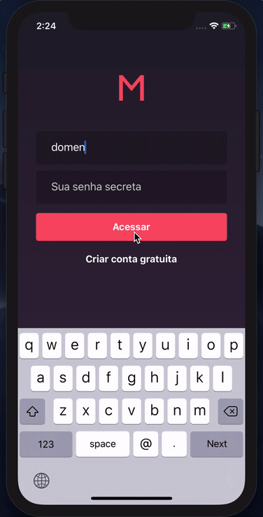

# MeetApp

Create and organize your meetup events and let people see the details about each event and confirm ther presence using an mobile app.

### Web

<div style="text-align: center">   
  <p>
    
  </p>
</div>

### Mobile

<div>
  
  
</div>

<br/>

### Final Challenge of Rocketseat Bootcamp

After clone this project, **init this modules**.

```bash
git submodule init && git submodule update
```

### Instalation

- [API](#API)
- [Web](#Web)
- [Mobile](#Mobile)

## [API](https://github.com/Domeniqque/gostack-meetup-api) (first)

Install packages on **API** directory

```bash
yarn
```

Copy `.env.example` to `.env`

```bash
cp .env.example .env
```

And configure these keys on `.env` file with yours private settings

```bash
## APPLICATION
APP_SECRET=

## MAIL
MAIL_USER=
MAIL_PASS=

## SENTRY
SENTRY_DSN=
```

Install **Docker** and **Docker Compose** to run next comands.

Run migrations to database

```bash
docker-compose run api yarn sequelize db:migrate
```

Finaly, run the API

```bash
docker-compose up -d
```

Awesome, your application is available on `http://localhost:3333`.

## [Web](https://github.com/Domeniqque/gostack-meetup-web)

Make sure **API** and **Reactotron** are available.

Install packages on **web** directory and start the application

```bash
yarn && yarn start
```

All right, your application is available on `http://localhost:3000`

## [Mobile](https://github.com/Domeniqque/gostack-meetup-mobile)

The mobile application was available for **IOS** only and was tested on **iPhone X** simulator with IOS 12.4.

On **mobile** directory, run:

```bash
yarn && cd ios && pod install
```

Before installation, run on **mobile** directory

```bash
yarn react-native run-ios
```
